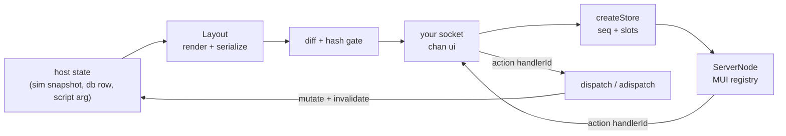
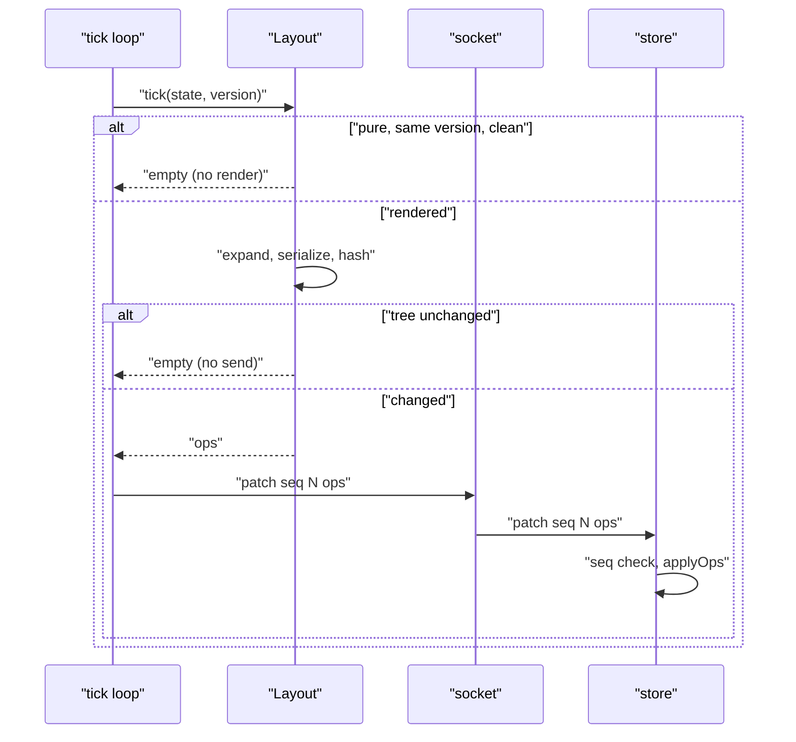
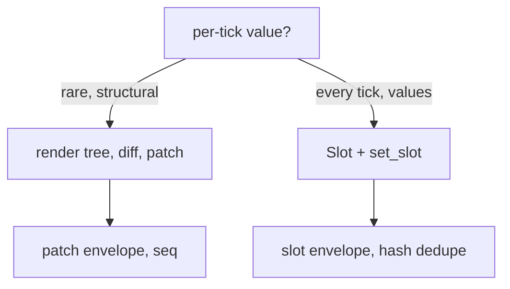
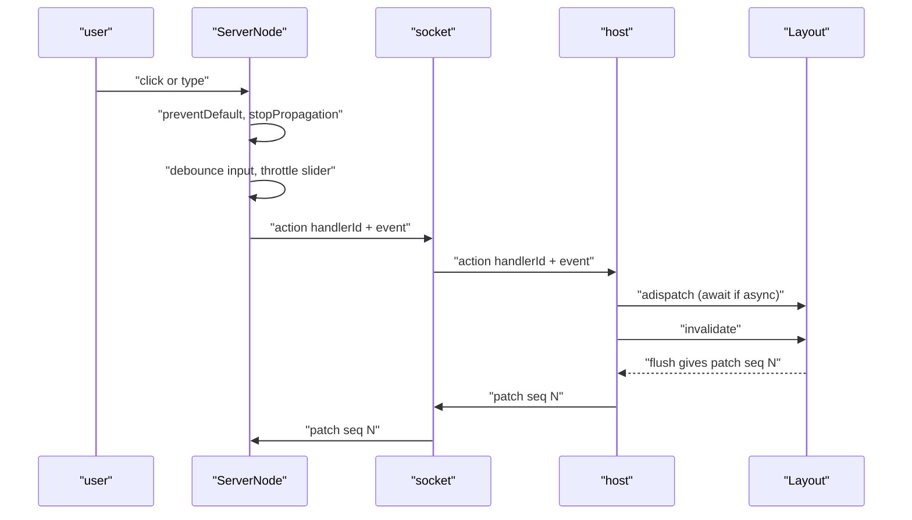
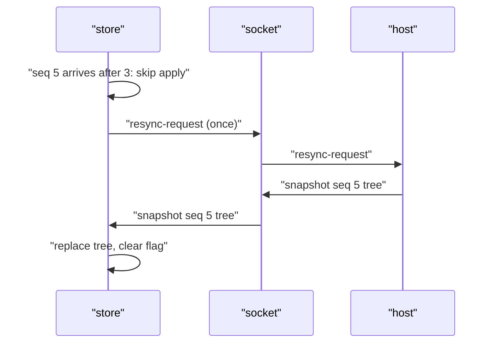
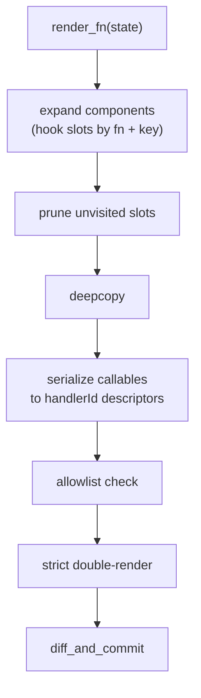
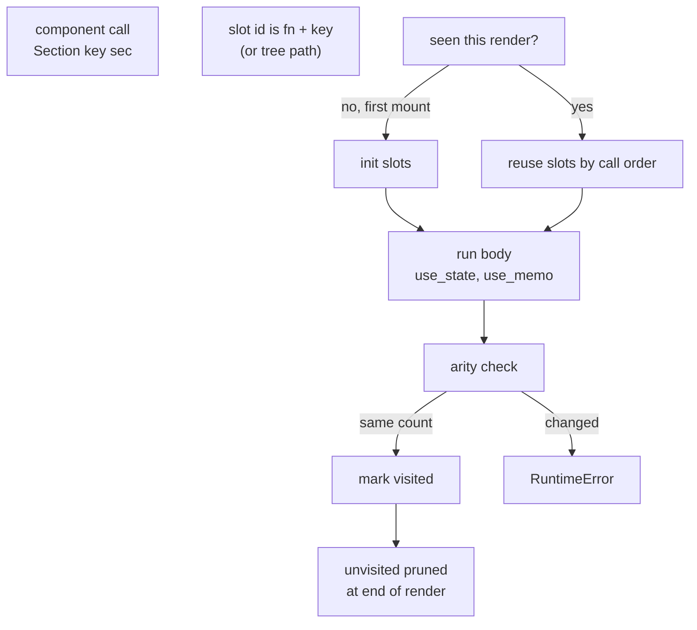
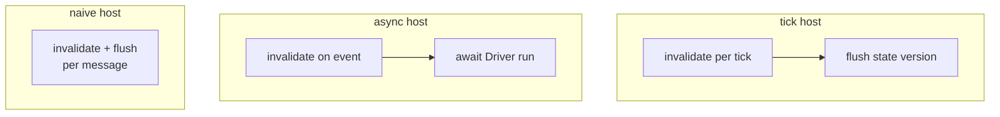

# How flyrail works

Python declares the UI. Your React app renders it. Your socket carries it.
Your tick (or event loop) drives it. This page traces every path a pixel
and a click can take. Start with `example/hmi_demo.py` for the narrated
version of the same flows.

## Big picture

There are exactly two loops: state flows down as trees and patches,
actions flow up as handler ids. Nothing else crosses the wire.

## Message catalog

| Message | Direction | Shape | Purpose |
|---|---|---|---|
| `patch` | server to client | `{chan, type, seq, ops}` | Tree diff since last send |
| `slot` | server to client | `{chan, type, name, value}` | Hot value bypassing the diff |
| `snapshot` | server to client | `{chan, type, seq, tree}` | Full tree (first paint, gap recovery) |
| `action` | client to server | `{chan, type, handlerId, event?}` | Click / change with optional value |
| `resync-request` | client to server | `{chan, type}` | "I skipped a seq, send snapshot" |

## Tick loop

Two independent gates: version-skip saves render CPU, the hash gate saves
socket traffic. Either can fire alone (see the `invalidate` test: re-render
with nothing to send). Version-skipping applies to renders marked `@pure`
(a declared contract: output is a pure function of arguments); unmarked
renders always re-render, and `strict=True` double-renders in dev to catch
nondeterminism.

## Cold path vs hot path

Rule of thumb: structure goes through patches, values through slots. A
table whose rows update at 60Hz is a `Slot("rows")`; a dialog opening is a
patch.

## Action round-trip

Notes: `preventDefault` runs synchronously in the React handler (a debounced
callback can no longer cancel the event). Async handlers are awaited before
invalidate so the re-render sees the saved state. Sync `dispatch` refuses
async handlers loudly instead of dropping the coroutine.

## Gap recovery

Applying an out-of-order patch would corrupt the tree silently, so the
store skips it and asks once (no resync spam while the gap persists).
Duplicates and stale seqs are ignored without asking.

## Render pipeline

Expansion happens before deepcopy so hook bodies run once per render;
serialization replaces each callable with `{handlerId, preventDefault,
stopPropagation, throttleMs?}`; the allowlist rejects unknown node types
on both ends (`__Slot__` exempt, `__Component__` never survives expansion).

## Hook slots

Keys follow reorders, positions behave React-like. Setters bail out on
identical values and schedule through `invalidate()`; `use_memo` recomputes
only on dep change (exotic values recompute rather than lie).

## Scheduling across hosts

One `Driver` primitive serves all three: dirty flag + seq counter shared by
`flush()` (sync) and `run()` (async, bursts coalesce). The raw-ASGI adapter
(`create_ws_app`) is the async recipe with one session per connection.
